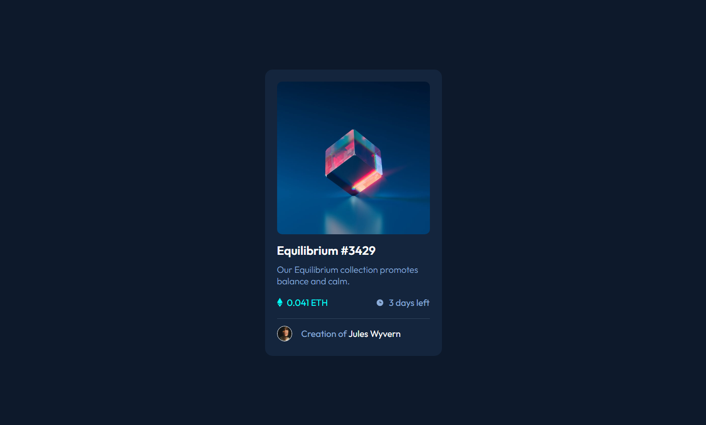

# Frontend Mentor - NFT preview card component solution

This is a solution to the [NFT preview card component challenge on Frontend Mentor](https://www.frontendmentor.io/challenges/nft-preview-card-component-SbdUL_w0U). Frontend Mentor challenges help you improve your coding skills by building realistic projects. 

## Table of contents

- [Overview](#overview)
  - [The challenge](#the-challenge)
  - [Screenshot](#screenshot)
  - [Links](#links)
- [My process](#my-process)
  - [Built with](#built-with)
  - [What I learned](#what-i-learned)
  - [Continued development](#continued-development)
  - [Useful resources](#useful-resources)
- [Author](#author)
- [Acknowledgments](#acknowledgments)

**Note: Delete this note and update the table of contents based on what sections you keep.**

## Overview

### The challenge

Users should be able to:

- View the optimal layout depending on their device's screen size
- See hover states for interactive elements

### Screenshot



### Links

- Solution URL: [Add solution URL here](https://your-solution-url.com)
- Live Site URL: [Add live site URL here](https://your-live-site-url.com)

## My process

### Built with

- Semantic HTML5 markup
- CSS custom properties
- Flexbox

### What I learned

I learned to code a little bit simpler then last time (used more properties in main this time) and also using before, after to make the needed elements interactive.

To see how you can add code snippets, see below:

```css
a::before {
    content: '';
    position: absolute;
    width: 100%;
    height: 100%;
    background: teal;
    opacity: 0;
    border-radius: 10px;
    z-index: 1;
} 

a::after {
    content: '';
    position: absolute;
    width: 100%;
    height: 100%;
    background-image: url("../images/icon-view.svg");
    background-repeat: no-repeat;
    top: 0;
    right: 0;
    bottom: 0;
    left: 0;
    background-position: center;
    opacity: 0;
    border-radius: 10px;
    z-index: 2;
}

a:hover::before {
    opacity: 0.7;
}

a:hover::after {
    opacity: 1;
}
```

### Continued development

I want to make more interactive things because that was kinda new to me.

### Useful resources

- [Example resource 1](https://app.slack.com/client/TCYEB44S2/CCYHFT85B/thread/CCYHFT85B-1648963844.709299) - This thread helped me because it had a nice explanation about the interactive part.

## Author

- Frontend Mentor - [@victorsonet](https://www.frontendmentor.io/profile/victorsonet)
- Twitter - [@GMLvictorsoN](https://twitter.com/GMLvictorsoN)
